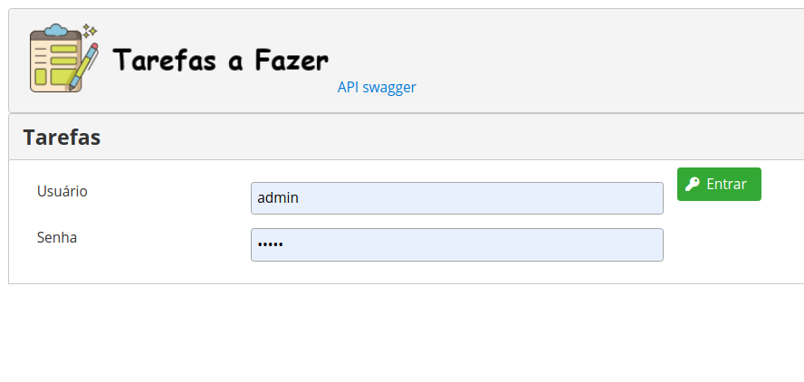
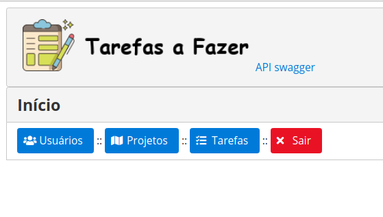
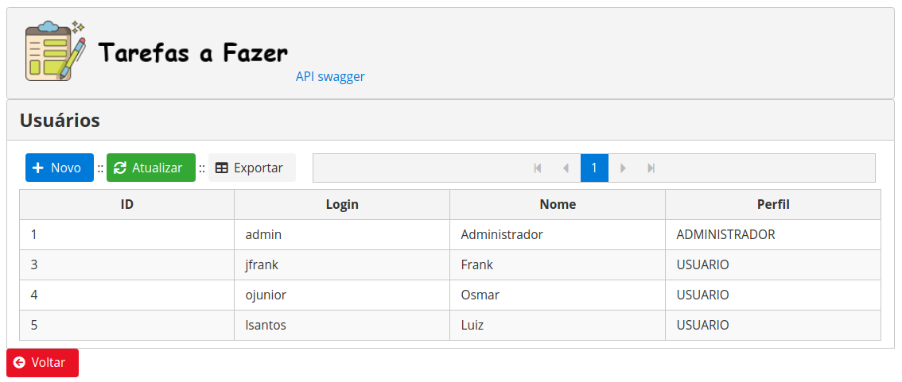
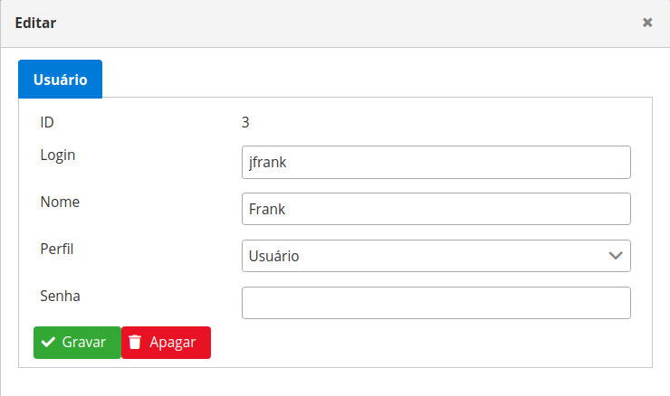
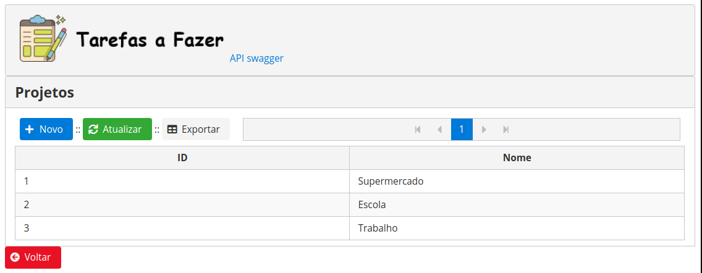
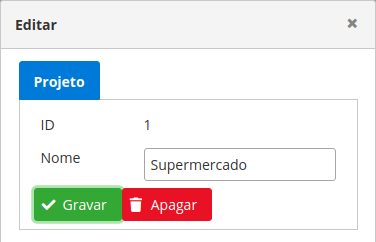
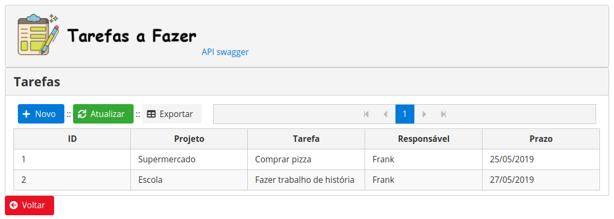
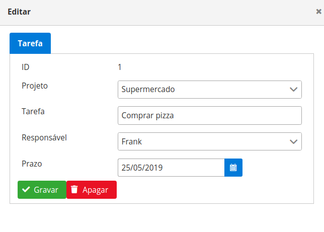
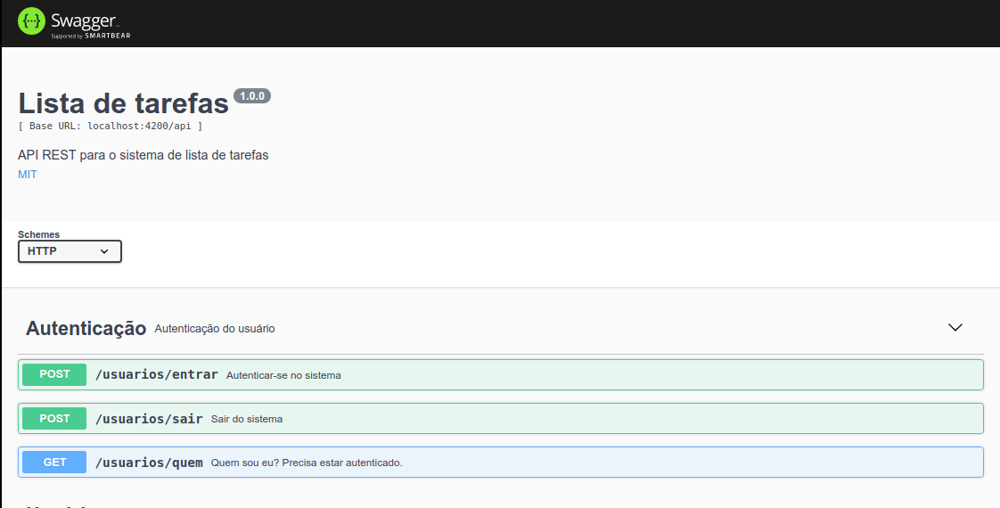

# Lista de Tarefas

- Autor: Frank Viana (jfrank1500@gmail.com)
- Ano: 2019
- [MIT](https://opensource.org/licenses/MIT)

## Requisitos
- nvm 0.33.8
- npm 6.9.0
- node v8.9.1
- OS: Linux x64
- Ver package.json das aplicações para maiores detalhes

## Instalação do Node

```bash
# Instalar o nvm como usuario comum
curl -o- https://raw.githubusercontent.com/nvm-sh/nvm/v0.34.0/install.sh | bash
# Instalar o node versão >= 8.9.1
nvm install v8.9.1
```

## Configuração do sistema

### Arquivo config/config.comum.ts
```typescript
export const PORTA = 4200; // Porta usada pelo servidor
```

### Arquivo config/config.backend.ts
```typescript
export const USAR_HTTPS = false; // Define se HTTP ou HTTPS será usado.
export const CHAVE_PRIVADA = 'senha123'; // Senha para chave privada se usar HTTPS.
export const SEMENTE_JWT = 'JSON-WEB-TOKEN'; // Assinatura para o JWT
export const BANCO_TIPO = 'sqlite3'; // sqlite3 ou mysql 
```

## Compilar backend
```bash
# Ir para a pasta do backend
$ cd backend
# Instalar dependencias
$ npm install
# Iniciar servidor de Backend
$ npm start
```
## Execução do sistema
- A aplicacao executará no endereço http://localhost:4200
- Usuário: **admin**
- Senha: **admin**

## Telas do sistema
### Tela de login

### Menu principal

### Gerenciamento de usuários

### Edição de usuário

### Gerenciamento de projetos

### Edição de projeto

### Gerenciamento de tarefas

### Edição de tarefa

### API REST do sistema
- Endereço da API: http://localhost:4200/api-docs/



## Passos opcionais

### Geração das chaves privada e pública auto-assinadas caso seja usado HTTPS 
```bash
# Gerar a chaves do servidor https
$ openssl req -x509 -newkey rsa:2048 -keyout chave_privada.pem -out chave_publica.pem -days 365
```
### Recriar pasta www a partir da pasta de frontend

```bash
# Instalar o Angular-CLI
$ npm install -g @angular/cli
# Ir para a pasta do frontend escrito em angular
$ cd frontend
# Instalar dependencias
$ npm i
# Construir a pasta www
$ ng build
```

## Principais frameworks usados no sistema

### Backend
- ExpressJS: construção de aplicativos web.
- Passport: autenticação de usuários.
- TypeORM: mapeamento objeto-relacional.

### Frontend
- Angular: construção de aplicativos web tipo Single Page Application.
- PrimeNG: coleção de componentes para o Angular.


